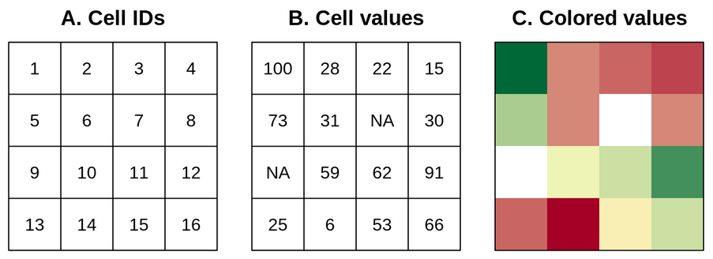

```{r setup, include=FALSE}
knitr::opts_chunk$set(echo = TRUE)
```

# Recursos de interés
* Libro: [Geocomputation with R. Lovelace, R., Nowosad, J., & Muenchow, J. (2019)](https://geocompr.robinlovelace.net/).

* Datos utilizados durante el curso: [Procesamiento de datos con R - datos](https://github.com/curso-r-simocute/datos).

# Trabajo previo
Se recomienda leer: 

* [Capítulos 2, 3 y 4 del libro  _Geocomputation with R_. Lovelace, R., Nowosad, J., & Muenchow, J. (2019)](https://geocompr.robinlovelace.net/).  

# Paquetes utilizados
```{r}
# dplyr: paquete de Tidyverse para manipulación de datos
library(dplyr)

# tidyr: paquete de Tidyverse para creación de datos "tidy"
library(tidyr)

# ggplot2: paquete de Tidyverse para graficación
library(ggplot2)

# sf: paquete para manejo de datos vectoriales
library(sf)

# raster: paquete para manejo de datos raster
library(raster)

# rgdal: paquete para manejo de datos raster
library(rgdal)

# leaflet: paquete para mapeo en la Web
library(leaflet)
```

# Conjuntos de datos utilizados

**Puntos de muestreo de cobertura y uso de la tierra**  
Este conjunto de datos fue generado como parte del Ejercicio de Monitoreo por Puntos del [Sistema de Monitoreo de Cobertura y Uso de la Tierra y Ecosistemas (Simocute)](https://simocute.go.cr/).

```{r}
# Carga de datos en un data frame desde un archivo CSV
df_puntos_muestreo <- 
  read.csv(
    file='https://raw.githubusercontent.com/curso-r-simocute/datos/main/puntosmuestreo-coberturauso-tierra/pnt_csv.csv'
  )
```

```{r eval=FALSE}
# Despliegue de los datos
View(df_puntos_muestreo)
```

**Casos activos de COVID-19 en Costa Rica**  
Este conjunto de datos es publicado por el [Ministerio de Salud de Costa Rica](http://geovision.uned.ac.cr/oges/) es un ejemplo de una [serie temporal](https://en.wikipedia.org/wiki/Time_series): una sucesión de datos medidos en determinados momentos y ordenados cronológicamente. Contiene un registro por día con las estadísticas de casos positivos, fallecidos, activos y recuperados.

```{r}
# Carga de datos en un data frame desde un archivo CSV, con fechas en las columnas
df_activos_cantones_ancho <- 
  read.csv(
    "https://raw.githubusercontent.com/curso-r-simocute/datos/main/covid/04_20_21_CSV_ACTIVOS.csv",
    sep = ";"
  )
```

```{r eval=FALSE}
# Despliegue de los datos
View(df_activos_cantones_ancho)
```

**Cantones de Costa Rica**
Este conjunto de datos es publicado por el [Instituto Geográfico Nacional (IGN)](http://www.registronacional.go.cr/instituto_geografico/) en el [Sistema Nacional de Información Territorial](https://www.snitcr.go.cr/).

Para la lectura de datos geoespaciales, se utiliza la función [st_read()](https://r-spatial.github.io/sf/reference/st_read.html).

```{r}
# Carga de datos desde un archivo GeoJSON
sf_cantones <-
  st_read(
    "https://raw.githubusercontent.com/curso-r-simocute/datos/main/delimitacion-territorial-administrativa/cr_cantones_wgs84.geojson", 
    quiet = T
)
```

Para visualizar el mapa, se utiliza la función [plot()](https://r-spatial.github.io/sf/reference/plot.html).

```{r eval=FALSE}
# Mapeo de los datos
plot(
  sf_cantones["geometry"], 
  axes = TRUE, 
  graticule = TRUE
)
```

# El ecosistema espacial de R
La comunidad de programadores de R ha desarrollado un conjunto de paquetes para el manejo de datos geoespaciales, tanto en formatos vectoriales como raster. Algunos de los principales de estos paquetes son:

* El paquete [sf](https://r-spatial.github.io/sf/) de R. Ofrece un conjunto de funciones para el manejo de datos vectoriales, de acuerdo con el estándar [Simple Features](https://www.ogc.org/standards/sfa).

* El paquete [raster](https://rspatial.org/raster/spatial/8-rastermanip.html) de R. Ofrece un conjunto de funciones para el manejo de datos raster.

* El paquete [Leaflet para R](https://rstudio.github.io/leaflet/). Es una implementación en R de la biblioteca [Leaflet para el lenguaje JavaScript](https://leafletjs.com/) para la programación de mapas interactivos en páginas web.

## Datos vectoriales

### El modelo vectorial de datos
El modelo vectorial de datos está basado en puntos localizados en un [sistema de referencia de coordenadas (CRS)](https://en.wikipedia.org/wiki/Spatial_reference_system). Los puntos individuales pueden representar objetos independientes (ej. la localización de un poste eléctrico o de una cabina telefónica) o pueden también agruparse para formar geometrías más complejas como líneas o polígonos. Por lo general, los puntos tienen solo dos dimensiones (x, y), a las que se les puede agregar una tercera dimensión _z_, usualmente correspondiente a la altitud sobre el nivel del mar.

### El estándar _Simple Features_
[_Simple Features_](https://www.ogc.org/standards/sfa) (o _Simple Feature Access_) es un estándar abierto de la [Organización Internacional de Estandarización (ISO)](https://iso.org/) y del [_Open Geospatial Consortium_ (OGC)](https://www.ogc.org/) que especifica un modelo común de almacenamiento y acceso para geometrías de dos dimensiones (líneas, polígonos, multilíneas, multipolígonos, etc.). El estándar es implementado por muchas bibliotecas y bases de datos geoespaciales como [sf](https://cran.r-project.org/web/packages/sf/index.html), [GDAL](https://gdal.org/), [PostgreSQL/PostGIS](https://en.wikipedia.org/wiki/PostGIS), [SQLite/SpatiaLite](https://www.gaia-gis.it/fossil/libspatialite/), [Oracle Spatial](https://www.oracle.com/database/technologies/spatialandgraph.html) y [Microsoft SQL Server](https://www.microsoft.com/en-us/sql-server/), entre muchas otras.

La especificación define 17 tipos de geometrías, de las cuales siete son las más comúnmente utilizadas. Estas últimas se muestran en la siguiente figura:


### El paquete sf
El paquete [sf](https://r-spatial.github.io/sf/) (de _Simple Features_) de R implementa los modelos de datos de las geometrías de tipo vectorial: puntos, líneas, polígonos, sus versiones múltiples y las colecciones de geometrías. Está basado en bibliotecas de sofware ampliamente utilizadas en aplicaciones geoespaciales:

* **GDAL**: [Geospatial Data Abstraction Library (GDAL)](https://gdal.org/) es una biblioteca para leer y escribir datos geoespaciales en varios formatos [raster](https://gdal.org/drivers/raster/) y [vectoriales](https://gdal.org/drivers/vector/). Implementa un único [modelo abstracto de datos raster](https://gdal.org/user/raster_data_model.html) y un único [modelo abstracto de datos vectoriales](https://gdal.org/user/vector_data_model.html), lo que permite programar aplicaciones geoespaciales sin tener que ocuparse de las particularidades de cada formato que se utilice (GeoTIFF, NetCDF, ESRI Shapefile, GeoJSON, etc.). A pesar de que GDAL está programada en C/C++, cuenta con una interfaz de programación de aplicaciones (API) para varios lenguajes de programación, incluyendo [C](https://gdal.org/api/index.html#c-api), [C++](https://gdal.org/api/index.html#id3), [Python](https://gdal.org/python/index.html) y [Java](https://gdal.org/java/overview-summary.html). Además, ofrece un conjunto de [utilitarios de línea de comandos](https://gdal.org/programs/) cuyas [distribuciones binarias](https://gdal.org/download.html#binaries) están disponibles para varios sistemas operativos, incluyendo Windows, macOS y Linux.
* **GEOS**: [Geometry Engine, Open Source (GEOS)](https://trac.osgeo.org/geos) es una implmentación en C++ de la biblioteca [JTS Topology Suite](http://www.tsusiatsoftware.net/jts/main.html) (desarrollada en Java) y que implementa un conjunto de operaciones y predicados geoespaciales (ej. unión, intersección, distancia, área).
* **PROJ**: [PROJ](https://proj.org/) es una biblioteca que transforma coordenadas entre diferentes CRS, incluyendo tanto proyecciones cartográficas como transformaciones geodésicas.

sf provee acceso, desde un mismo paquete de R, a la funcionalidad de estas tres bibliotecas, proporcionando así una interfaz unificada para leer y escribir datos geoespaciales mediante GDAL, realizar operaciones con geometrías mediante GEOS y efectuar transformaciones entre sistemas de coordenadas mediante PROJ.

En sf, los conjuntos de datos geoespaciales se almacenan en un data frame que contiene una columna especial para las geometrías. Esta columna se denomina generalmente ```geom``` o ```geometry```. El manejo de datos geoespaciales como data frames, permite manipularlos con las funciones ya desarrolladas para data frames (ej. ```summary()```, ```View()```, ```str()```) y con la misma forma de referencias las filas (observaciones) y las columnas (variables).

En el siguiente ejemplo, se cargan en un objeto sf los datos de casos activos de COVID-19 en los cantones de Costa Rica. Para procesar y transformar los datos, se utilizan los paquetes [dplyr](https://dplyr.tidyverse.org/) y [tidyr](https://tidyr.tidyverse.org/), ambos parte de [Tidyverse](https://www.tidyverse.org/), una colección de paquetes de R especializados en [ciencia de datos](https://es.wikipedia.org/wiki/Ciencia_de_datos).

```{r warning=FALSE, message=FALSE}
# Data frame de casos activos de covid por cantón, con fechas en las filas
df_activos_cantones <-
  df_activos_cantones_ancho %>%
  pivot_longer(
    cols = c(-cod_provin, -provincia, -cod_canton, -canton), 
    names_to = "fecha", 
    values_to = "activos"
  )

# Cambio de tipo de la columna "fecha"
df_activos_cantones$fecha <- as.Date(df_activos_cantones$fecha, "X%d.%m.%Y")

# Data frame de casos activos por cantón en la última fecha
df_activos_cantones_ultima_fecha <- 
  df_activos_cantones %>%
  filter(fecha == max(fecha, na.rm = TRUE)) %>%
  dplyr::select(cod_canton, activos)

# Objeto sf de casos activos en cantones en la última fecha
sf_activos_cantones_ultima_fecha <-
  left_join(sf_cantones, df_activos_cantones_ultima_fecha, by = c('cod_canton')) %>%
  arrange(desc(activos))
```


El objeto sf resultante puede mapearse con la función [plot()](https://r-spatial.github.io/sf/reference/plot.html).

```{r warning=FALSE, message=FALSE}
# Mapeo de los casos activos
plot(
  sf_activos_cantones_ultima_fecha["activos"], 
  breaks = "pretty",
  axes = TRUE,
  graticule = TRUE
)
```

El mismo mapa se muestra seguidamente mediante [Leaflet](https://rstudio.github.io/leaflet/), un paquete para generar mapas web.

```{r warning=FALSE, message=FALSE}
bins <- c(0, 100, 200, 500, 1000, 2000, Inf)
pal_actives <- 
  colorBin(
    "YlOrRd", 
    domain = sf_activos_cantones_ultima_fecha$activos, 
    bins = bins
  )

leaflet(sf_activos_cantones_ultima_fecha) %>% 
  fitBounds(lng1 = -86, lng2 = -82, lat1 = 8, lat2 = 11) %>%
  addProviderTiles(providers$OpenStreetMap.Mapnik, group = "OpenStreetMap") %>%
  addPolygons(fillColor = ~pal_actives(activos), stroke=T, fillOpacity = 1,
              color="black", weight=0.2, opacity= 0.5,
              group = "Cantones",
              popup = paste("Provincia: ", sf_activos_cantones_ultima_fecha$provincia, "<br>",
                            "Cantón: ", sf_activos_cantones_ultima_fecha$canton, "<br>",
                            "activos: ", sf_activos_cantones_ultima_fecha$activos
                            )
  ) %>%
  addLegend("bottomright", pal = pal_actives, values = ~activos,
    title = "Casos activos",
    opacity = 1
  ) %>%  
  addLayersControl(
    baseGroups = c("OpenStreetMap"),
    overlayGroups = c("Cantones"),
    options = layersControlOptions(collapsed = TRUE)    
  ) %>%  
  addMiniMap(
    toggleDisplay = TRUE,
    position = "bottomleft",
    tiles = providers$OpenStreetMap.Mapnik
  )
```

En el siguiente ejemplo, se utiliza la función ```st_read()``` para leer un archivo CSV con columnas correspondientes a coordenadas geográficas y cargarlo en un objeto sf.

```{r warning=FALSE, message=FALSE}
# Lectura de archivo CSV con columnas correspondientes a longitud y latitud
sf_puntos_muestreo <- 
  st_read(
    "https://raw.githubusercontent.com/curso-r-simocute/datos/main/puntosmuestreo-coberturauso-tierra/pnt_csv.csv", 
    options = c("X_POSSIBLE_NAMES=lon","Y_POSSIBLE_NAMES=lat")
  )
```

Mapeo con ```plot()```.

```{r warning=FALSE, message=FALSE}
# Capa base del mapa
plot(
  sf_cantones$geometry, 
  ext=extent(-86, -82.3, 8, 11.3),
  main="Puntos de muestreo de cobertura y uso del suelo",
  reset=FALSE, 
  axes = TRUE,
  graticule=TRUE
)

# Capa de puntos de muestreo
plot(
  sf_puntos_muestreo$geometry, 
  add = TRUE, 
  col = "blue",
  size = 0.05
)
```

Mapeo con ```leaflet()```.

```{r warning=FALSE, message=FALSE}
leaflet() %>% 
  addProviderTiles(providers$Esri.WorldImagery, group = "Imágenes de ESRI") %>% 
  addProviderTiles(providers$Stamen.TonerLite, group = "Stamen Toner Lite") %>%
  addProviderTiles(providers$OpenStreetMap.Mapnik, group = "OpenStreetMap") %>%
  addCircleMarkers(
    data = sf_puntos_muestreo,
    stroke = TRUE,
    radius = 0.5,
    fillColor = 'orange',
    fillOpacity = 1,
    group = "Puntos de muestreo",    
    popup = paste0(
      "T1.COBERTURA: ", sf_puntos_muestreo$T1.COBERTURA, 
      "<br>T2.COBERTURA: ", sf_puntos_muestreo$T2.COBERTURA, 
      "<br>T1.USO: ", sf_puntos_muestreo$T1.USO, 
      "<br>T2.USO: ", sf_puntos_muestreo$T2.USO)
  ) %>%
  addLayersControl(
    baseGroups = c("OpenStreetMap", "Stamen Toner Lite", "Imágenes de ESRI"),
    overlayGroups = c("Puntos de muestreo")    
  ) %>%
  addMiniMap(
    toggleDisplay = TRUE,
    tiles = providers$Stamen.TonerLite
  )
```

## Datos raster

### El modelo de datos raster
El modelo de datos raster usualmente consiste de un encabezado y de una matriz con celdas (también llamadas pixeles) de un mismo tamaño. El encabezado define el [sistema de referencia de coordenadas (CRS)](https://en.wikipedia.org/wiki/Spatial_reference_system), la extensión y el punto de origen de una capa raster. Por lo general, el origen se ubica en la esquina inferior izquierda o en la esquina superior izquierda de la matriz. La extensión se define mediante el número de filas, el número de columnas y el tamaño (resolución) de la celda.

Cada celda tiene una identificación (ID) y almacena un único valor, el cual puede ser numérico o categórico, como se muestra en la figura siguiente. 



A diferencia del modelo vectorial, el modelo raster no necesita almacenar todas las coordenadas de cada geometría (i.e. las esquinas de las celdas), debido a que la ubicación de cada celda puede calcularse a partir de la información contenida en el encabezado. Esta simplicidad, en conjunto con el [álgebra de mapas](https://en.wikipedia.org/wiki/Map_algebra), permiten que el procesamiento de datos raster sea mucho más eficiente que el procesamiento de datos vectoriales. Por otra parte, el modelo vectorial es mucho más flexible en cuanto a las posibilidades de representación de geometrías y almacenamiento de valores, por medio de múltiples elementos de datos.

Los mapas raster generalmente almacenan fenómenos continuos como elevación, precipitación, temperatura, densidad de población y datos espectrales. También es posible representar mediante raster datos discretos, tales como tipos de suelo o clases de cobertura de la tierra, como se muestra en la figura siguiente.


### El paquete raster
El paquete [raster](https://cran.r-project.org/web/packages/raster/) proporciona funciones para la lectura, escritura, manipulación, análisis y modelado de datos raster. El paquete raster utiliza el paquete [rgdal](https://cran.r-project.org/web/packages/rgdal/), el cual proporciona enlaces a las bibliotecas [GDAL](https://gdal.org/) y [PROJ](https://proj.org/).

En el ejemplo siguiente, se utiliza la función [getData()](https://rdrr.io/cran/raster/src/R/getData.R) para obtener una capa raster de altitud de [WorldClim](https://www.worldclim.org/).

```{r warning=FALSE, message=FALSE}
# Directorio de trabajo (¡¡DEBE USARSE UN DIRECTORIO EXISTENTE EN EL DISCO LOCAL!!)
setwd("c:/users/mfvargas/")

# Datos de altitud
raster_altitud <- getData("worldclim", var="alt", res=.5, lon=-84, lat=10)

# Datos de altitud recortados para los límites aproximados de Costa Rica
raster_altitud_cr <- 
  raster_altitud %>%
  crop(sf_cantones) %>%
  mask(sf_cantones)

# Resumen de información básica de la capa raster
raster_altitud_cr
```

Mapeo con ```plot()```.

```{r warning=FALSE, message=FALSE}
# Capa base del mapa
plot(
  raster_altitud_cr, 
  ext=extent(-86, -82.3, 8, 11.3),
  main="Puntos de muestreo de cobertura y uso del suelo",
  reset=FALSE, 
  axes = TRUE,
  graticule=TRUE
)

# Capa de puntos de muestreo
plot(
  sf_puntos_muestreo$geometry, 
  add = TRUE, 
  col = "blue",
  size = 0.05
)
```

Mapeo con ```leaflet()```.

```{r warning=FALSE, message=FALSE}
# Paleta de colores
pal <- colorNumeric(
  #c("#0C2C84", "#41B6C4", "#FFFFCC"), 
  "YlGnBu",
  values(raster_altitud_cr), 
  na.color = "transparent"
)
# Mapa web
leaflet() %>% 
  fitBounds(lng1 = -86, lng2 = -82.3, lat1 = 8, lat2 = 11.3) %>%
  addProviderTiles(providers$Esri.WorldImagery, group = "Imágenes de ESRI") %>% 
  addProviderTiles(providers$Stamen.TonerLite, group = "Stamen Toner Lite") %>%
  addProviderTiles(providers$OpenStreetMap.Mapnik, group = "OpenStreetMap") %>%
  addRasterImage(raster_altitud_cr, 
                 colors = pal, 
                 opacity = 0.8, 
                 group = "Altitud"
  ) %>%
  addCircleMarkers(
    data = sf_puntos_muestreo,
    stroke = TRUE,
    radius = 0.5,
    fillColor = 'orange',
    fillOpacity = 1,
    popup = paste0(
      "T1.COBERTURA: ", sf_puntos_muestreo$T1.COBERTURA, 
      "<br>T2.COBERTURA: ", sf_puntos_muestreo$T2.COBERTURA, 
      "<br>T1.USO: ", sf_puntos_muestreo$T1.USO, 
      "<br>T2.USO: ", sf_puntos_muestreo$T2.USO),
    group = "Puntos de muestreo"
  ) %>%  
  addLayersControl(
    baseGroups = c("OpenStreetMap", "Stamen Toner Lite", "Imágenes de ESRI"),
    overlayGroups = c("Altitud", "Puntos de muestreo"),
    options = layersControlOptions(collapsed = FALSE)    
  ) %>%
  addLegend(pal = pal, 
            values = values(raster_altitud_cr), 
            title = "Altitud"
  ) %>%
  addMiniMap(
    toggleDisplay = TRUE,
    position = "bottomleft",
    tiles = providers$Stamen.TonerLite
  )
```